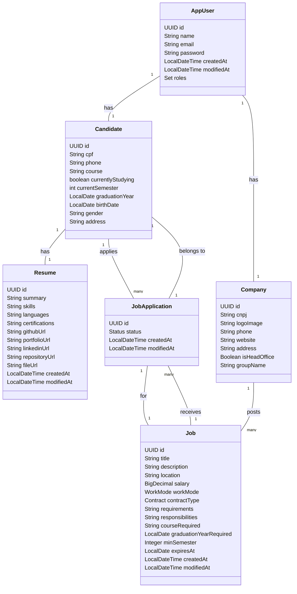

# 📘 Diagrama de Classes - HireSync

Este documento descreve as entidades principais do sistema, seus atributos e relacionamentos.

---

## 📊 Diagrama UML (Mermaid)

---

## 🧩 Enums Utilizados

- **Role**: Enum que representa o papel do usuário (ex: ADMIN, CANDIDATE, COMPANY).
- **WorkMode**: Enum para modalidade de trabalho (ex: REMOTE, HYBRID, ON_SITE).
- **Contract**: Enum para tipo de contrato (ex: INTERNSHIP, FULL_TIME).
- **Status**: Enum para status de aplicação (ex: PENDING, APPROVED, REJECTED).
